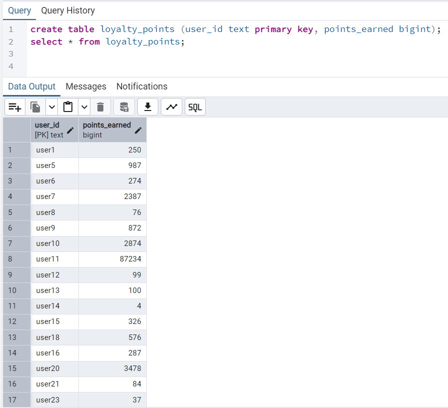

This project is to add the loyal points for the customers of a gas station chain who has purchased other items from
various credit card companies.

As an example, we took 3 columns in the csv format with:
1st column: serial no. just to track of the number of records.
2nd column: user ids to ditinguish each user individually
3rd column: transaction ids. In this context of loyalty program, it has no effect and we are not using it.
4th column: timestamp of the transaction. We are not actively using this column also.

This is the sample table created in postgreSQL database to insert/update the loyalty points user has earned based on
credit card spending.

Thought Process:

1. If the machine turns off abruptly?
   A. We are tyring to process records as batches. We considered each batch size as 10. At the end of the persisting to
   DB, we are saving the state of the object
   of last item by serializing it.
   Whenever machine turns off and starts again, we first check that serialized object by deserializing it and start
   processing our records in csv after that particular
   record. In that way, we can avoid duplicacy of records.

2. If the records already exists in DB?
   A. For that we are trying to check if the user_id exists or not. If so, fetch the latest points earned and sum up the
   new points. At this moment, assume each dollar in the
   amount column in csv corresponds to each loyalty point. We can customize it also as per our needs say credit 1 point
   for every $100 amount spent.

3. We are following the ExecutorService framework in Java. We want to process the data paralelly by the worker threads
   handled by the executor. The no. of threads depend
   on the available cores in the machine.

Each member class explanation:
CreditCardDataProcessor --> This is the main class responsible to read the csv file. Before doing that, it will first
try to
SaveTask --> This class is responsible to perform each runnable task. This task could be extracting the stringified data
to LoyaltyPoints object and add to the queue and process them to DB.
BatchInsert --> DAO layer to connect and interact with DB.
LoyaltyPoints --> Pojo to handle the earned points data with user information.

